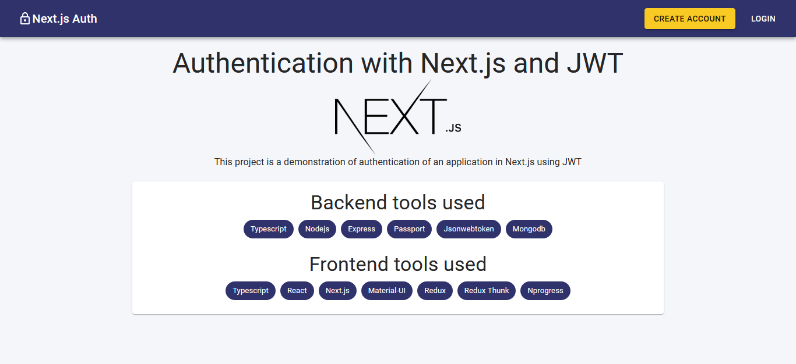
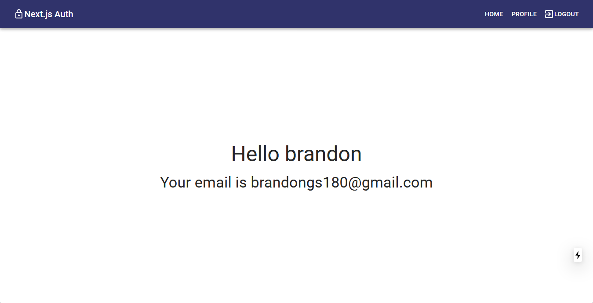

# TypeScript Next.js JWT Authentication

This project is a demonstration of authentication of an application in Next.js using JWT

### Installation:

Make sure you have Node and NPM installed.

```bash
npm install
```

### Create an .env file in root dir:

This file is necessary to run the application, the file should be like the following:

```.env
MONGO_URI=mongodb://localhost/test-auth
JWT_SECRET=MY_JWT_SECRET_I_MUST_REPLACE_THIS_IN_PRODUCTION
```

You must replace JWT_SECRET variable in production for added security

### Starting the app:

```bash
# Run in dev mode:
npm run dev

# Run in production:
npm run build
npm start
```

## Idea:

Server side rendered apps are awesome. They make a sweet spot between monolithic apps and single page apps powered by microservices. But they also add complexity to their creation. Keeping state on the server and the client in sync, routing on the client and the server, loading data before server rendering, etc. are some of the things that make our apps more complex. That is why frameworks such as Next.js exist, to solve most of those problems. However, things such as authentication are left to us. This is an attempt to implement the authentication based on JWT. The thing is that we can't store tokens in localStorage as we would do with SPA.

The idea is to receive token from the server on the client, store it in cookies, and then whenever a page renders on the server, we would be able to access the token from the cookie.

## How it works:

#### The client:

The user sends an auth request from the client. In the response, JWT is received, and stored in browser cookies and redux store. Then the user has access to the token from the client, and can use it to access protected routes.

#### The server:

When the user makes a page request, cookies are also sent along, so the server can read them. To read it, the user is using the `getServerSideProps` lifecycle method, provided by Next.js with a Wrapper from next-redux-wrapper module. It gets an argument - the context object that contains some properties. You can read more about it [here](https://nextjs.org/docs/basic-features/data-fetching#getserversideprops-server-side-rendering). On the `req` server property, we can access `headers` property which contains the cookie with the token. An action creator is dispatched to save the token in the redux store, and the app now has access to the token again.

## Screenshot






## Technologies

- Typescript
- Node
- Express
- MongoDB
- Passport
- Jsonwebtoken
- React
- Nextjs
- Redux
- Redux thunk
